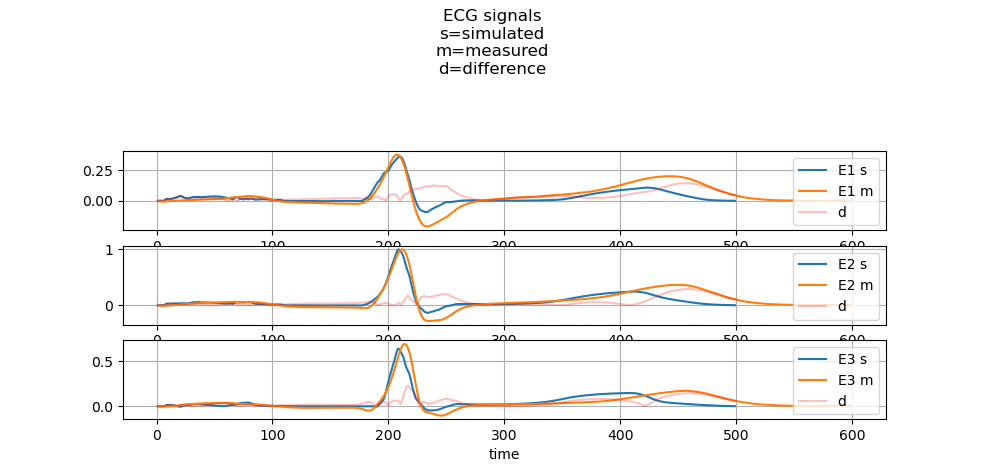
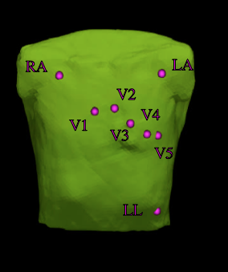
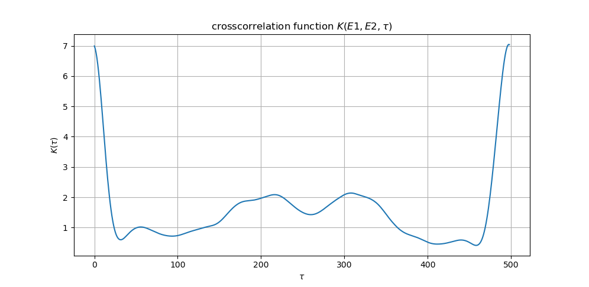
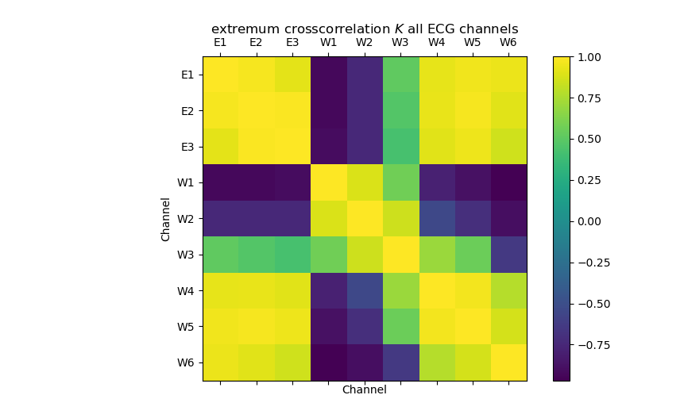
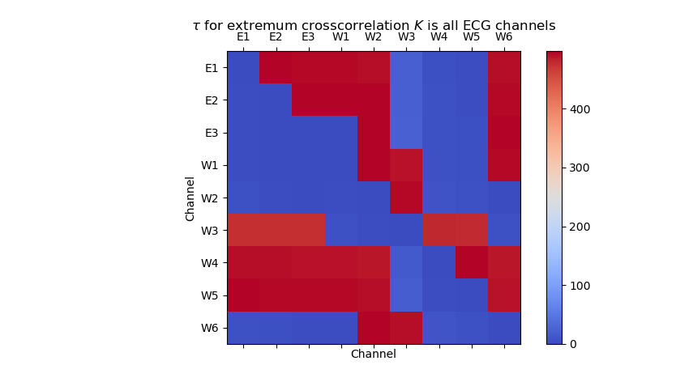
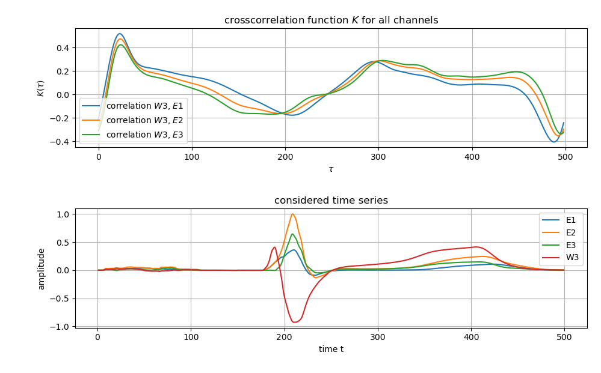
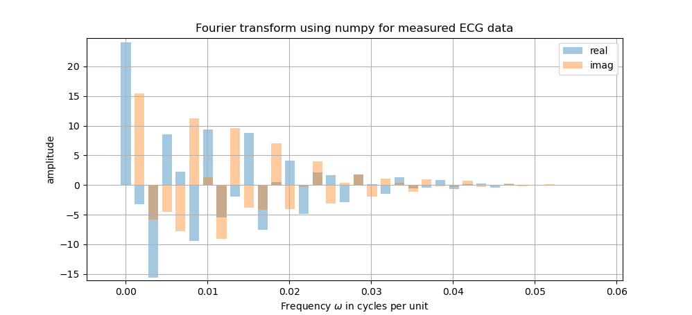
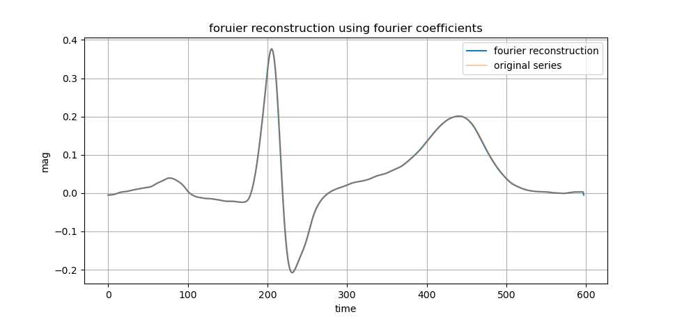
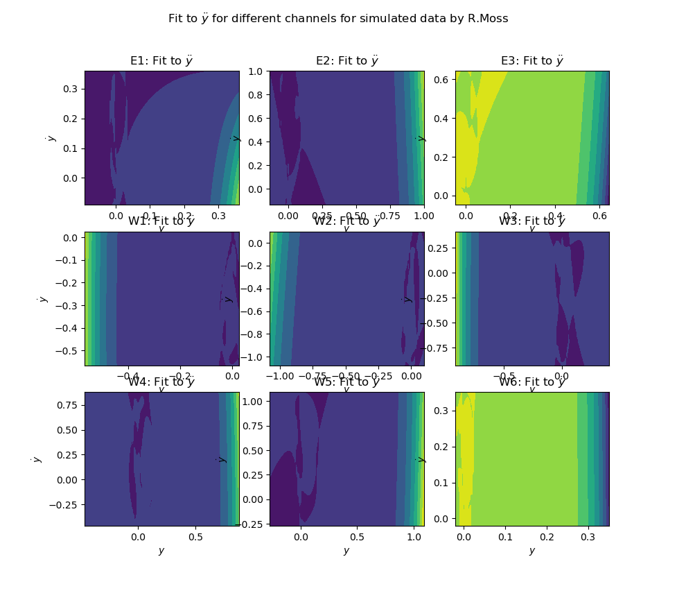

# Model reconstruction and analysis of ECG time series

## Abstract - the idea
tba

## ECG timeseries
ECG - electrocardiography is the process of producing an electrocardiogramm. It is a graph of voltage versus time of the electrical activity of the heart using electrodes placed on the skin. These electrodes detect the small electrical changes that are a consequence of cardiac muscle depolarization followed by repolarization during each cardiac cycle. [Wikipedia]

We received measured and simulated ecg timeseries by Robin Moss. These timeseries are shown in the figure below.

ECG timeseries are generated at multiple points on the skin. In our case we do have nine points, resulting in a 9D-system. The points where measurements are taken off the skin are shown in the figure below.

)

Taking into account that we can not interpret these signals directly, we calculate differences of signals and receive therefore the used timeseries:

$$
E1 = LA - RA
\\
E2 = LL - RA
\\
E3 = LL -LA
\\
W1 = V1 - norm
\\
W2 = V2 - norm
\\
W3 = V3 - norm
\\
W4 = V4 - norm
\\
W5 = V5 - norm
\\
W6 = V6 - norm
$$

where $norm = \frac{LA + RA + LL}{3}$.

## Crosscorrelation analysis
A correlation analysis is one way to find out how a change in one signal affects another signal in the same system at a different point in time. It returns a unitless correlation-value function, which can be taken as a measurement for correlation at different time differences. Having mentioned that it lacks a unit, it makes sense to normalize it for easier interpretation.

Having a look at the ecg timeseries above one expects trivially a strong correlation between the ecg signals.

Using the 2x9 (9 simulated, 9 measures) ECG time series as $x(t)$ or $y(t)$. The formula for the crosscorrelation reads:

$$
K(\tau) = \int_{-\infty}^{\infty} x(t)y(t+\tau) dt
$$

The ECG time series are present as discrete signals $x_i, y_i$, so that the above formula can be written as, and normalized by the effective value:

$$
K(\tau) = \frac{\sum_{i=1}^N x_i\cdot y_{i + \tau}}{\sqrt{\sum_{i=1}^N (x_i)^2 \cdot \sum_{i=1}^N (y_{i+\tau})^2}}
$$

Applied to channel $E1,E2$ the crosscorrelation function looks the following:

As we are interested in the maximum correlation we can draw a grid of all correlations to all cannels:

Yellow values mean a strong in-phase correlation, while purple values suggest a strong anticorrelation.

One sees that a strong anticorrelation between channels $W1...W3$ to $E1...E3$ is present. This simply results in the way how these signals are calculated. Refer to this in section "ECG timeseries".

As we further interpret the correlations, we need to take a look at what time differences the stronges absolute correlation is present. This was done and the results are shown in the figure below.

It is clearly visible, that the strongest correlations happen to be at the maximum of time differences. Having a look at the signals this makes totally sense - as they appear quite similarly. Noticably the slightly different values for $\tau$ at channel $W3$, where $\tau$ equals roughly $25$ for the correlation analysis with channels $E1...E3$. This needs further investigation, which is shown in the figure below.

Looking at the time series the reason for the crosscorrelation with $K\le0.5$ is obvious. The peak of $E1...E3$ follows the smaller peak of $W3$.

Keeping in mind that the so processed timeseries are quite short, one must consider analyzing larger series of ecg signals.

## Fourier analysis
The signals were fourier transformed. The fourier transformation of $E1$ is shown below.
By this the signale could be represented by sinusoids - which is also shown below.

## Fitting each channel
For the sake of reconstructing a 1D timeseries (aka receving a model which outputs the same, or at least a quite similat, timeseries, which was used to reconstruct the system), a least square fit methid was used to fit each provided timeseries idividually to a nonlinear system. A resulting oscillating system was expected.

### The method described
The ECG time series $y$ shall be represented by a set of differential equations. We achieve that by fitting $y$ to functions $f$:

$$
\dot{y} = f_1(y, \dot{y})\\
\ddot{y} = f_2(y, \dot{y})
$$

From the initial time series $y$, $\dot{y}$ and $\ddot{y}$ were calculated numerically using a five point derivate. Using the mentioned least square fit method, $f_1$ and $f_2$ were be derived. If the ansatz of the nonlinear oscillator is true, the first component, $f_1$ should be linear.

With $n$ dimensions. We want to find a function $f$ to fit the series depending on a vector $\vec{p}$. We choose $f(y_i,\dot{y}_i;\vec{p})=p_0\cdot y+p_1 \cdot \dot{y} + p_2 \cdot y^2 + p_3 \cdot y \cdot \dot{y} + p_4 \cdot \dot{y}^2$ where the dataset $\{y, \dot{y}\}$ is the one we want $f$ to be fitted to.

$$
\frac{1}{n} \sum_i^n(f(y_i,\dot{y}_i;\vec{p})-z_i)^2 = Min.
$$

Which is equivalent to:

$$
\frac{\partial}{\partial p_k}\sum_i^n(f(y_i,\dot{y}_i;\vec{p})-z_i)^2=\sum_i^n(f(y_i,\dot{y}_i;\vec{p})-z_i)\frac{\partial}{\partial p_k}f(y_i,\dot{y}_i;\vec{p})=0
$$

Which yields a system of equations. Written in $A\cdot p=b$:

$$
\begin{pmatrix}
\sum_i^n y_i^2 & \sum_i^n y_i \dot{y}_i & \sum_i^n y_i^3 & \sum_i^n y_i^2 \dot{y}_i & \sum_i^n y_i \dot{y}_i^2 \\
\sum_i^n y_i \dot{y}_i & \sum_i^n \dot{y}_i^2 & \sum_i^n y_i^2 \dot{y}_i & \sum_i^n y_i \dot{y}_i^2 & \sum_i^n \dot{y}_i^3 \\
\sum_i^n y_i^3 & \sum_i^n y_i^2 \dot{y}_i & \sum_i^n y_i^4 & \sum_i^n y_i^3 \dot{y}_i & \sum_i^n y_i^2 \dot{y}_i^2 \\
\sum_i^n y_i^2 \dot{y}_i & \sum_i^n y_i \dot{y}_i^2 & \sum_i^n y_i^3 \dot{y}_i & \sum_i^n y_i^2 \dot{y}_i^2 & \sum_i^n y_i \dot{y}_i^3 \\
\sum_i^n y_i \dot{y}_i^2 & \sum_i^n \dot{y}_i^3 & \sum_i^n y_i^2 \dot{y}_i^2 & \sum_i^n y_i \dot{y}_i^3 & \sum_i^n y_i \dot{y}_i^4 \\
\end{pmatrix}
\cdot
\begin{pmatrix}
p_0 \\
p_1 \\
p_2 \\
p_3 \\
p_4 \\
\end{pmatrix}
=
\begin{pmatrix}
\sum_i^n z_i y_i \\
\sum_i^n z_i \dot{y}_i \\
\sum_i^n z_i y_i^2 \\
\sum_i^n z_i y_i \dot{y}_i \\
\sum_i^n z_i \dot{y_i}^2 \\
\end{pmatrix}
$$

Solving for $\vec{p}$ yields:

$$
\vec{p} = A^{-1} \cdot b
$$

where $A^{-1}_{ij} = \frac{\alpha_{ij}}{|A|}$ and $\alpha_{ij}$ are the elements of the adjoint matrix $A_{ad}$.

The method was implemented with variable grade.

### Results for $f_2$ visualized
In the below figure the results for a fit to $f_2$ is visualized. A grade eight polynominal was used. The fit was done for all nine channels of each set (measured, simulated data).

### Problems occured while solving the resulting ODE
Unexpectedly while solving the reconstructed ODE system, the resulting timeseries did converge to infinity. Even when trying out even higher polynominal grades, the result would still be incorrect.

An ansatz to solve the occured problem was to set for $f(y_i,\dot{y}_i;\vec{p})$ the first coefficient $p_0=\frac{2\pi}{T}$, resulting into:

$f(y_i,\dot{y}_i;\vec{p})=\frac{2\pi}{T}\cdot y+p_1 \cdot \dot{y} + p_2 \cdot y^2 + p_3 \cdot y \cdot \dot{y} + p_4 \cdot \dot{y}^2$

Hoping this would force the resulting timeseries onto a periodical trajectory.

## Stochastic analysis: Kramers-Moyal coefficient estimation